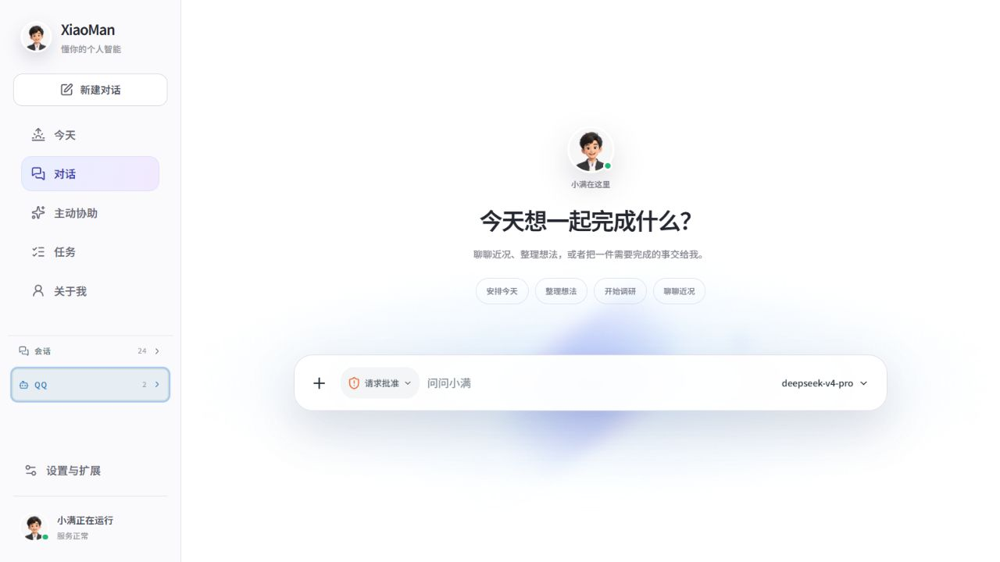
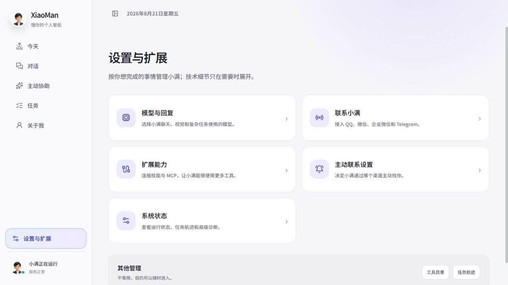
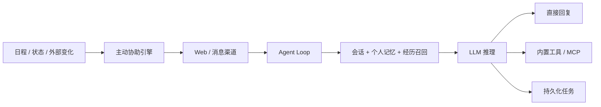

<div align="center">
  
  <h1>小满 Xiaoman</h1>
  <p>会记得、会执行，也会在合适时机主动帮助你的本地个人 AI 助手。</p>

  [](https://www.python.org/)
  [](https://react.dev/)
  [](LICENSE)
</div>

小满是一个面向个人长期使用场景的开源 AI Agent。它把实时聊天、长期记忆、复杂任务、主动协助、Skills 与 MCP 工具整合到同一个本地运行时中。你的会话、记忆和配置默认保存在自己的电脑上。

> 当前项目处于快速迭代阶段，适合个人部署、二次开发和 Agent 架构研究。Dashboard 默认只监听 `127.0.0.1`，请勿在没有额外鉴权的情况下直接暴露到公网。

## 界面预览





## 核心能力

- **本地个人助手**：Web Dashboard、流式 Markdown 对话和可追溯工具调用。
- **分层记忆**：受治理的个人事实、可验证的执行经验，以及可回源的 Akasha 对话召回。
- **记忆治理**：来源、可信度、敏感等级、有效期、冲突确认、替代链和彻底删除。
- **复杂任务**：基于 LangGraph 的持久化任务、依赖图、审批、等待、重试与重启恢复。
- **主动协助**：结合时间、场景、免打扰和反馈，在值得且合适时提醒或行动。
- **扩展能力**：支持 Skills，以及本地 stdio、远程 HTTP/SSE 和 OAuth MCP 服务。
- **多模型分工**：可分别配置主模型、快速模型、复杂任务模型、视觉模型和向量模型。
- **多渠道接入**：内置 Web，并提供 Telegram、QQ、微信、企业微信和飞书适配能力。

## 工作方式



小满不会把所有信息混在一个向量库里：`personal.db` 保存受治理的个人事实，执行记忆保存经过工具结果验证的操作经验，Akasha 从原始会话构建可重建的语义与联想索引。

## 快速开始

### 环境要求

- Python 3.12
- Node.js 20.19 或更高版本（构建 Dashboard）
- 至少一个兼容 OpenAI API 格式的模型服务
- Windows、macOS 或 Linux

### 1. 获取源码

```bash
git clone https://github.com/Houyanbin2002/Xiaoman-agent.git
cd Xiaoman-agent
```

### 2. 安装后端依赖

Windows PowerShell：

```powershell
py -3.12 -m venv .venv
.\.venv\Scripts\Activate.ps1
python -m pip install -r requirements.txt
```

macOS / Linux：

```bash
python3.12 -m venv .venv
source .venv/bin/activate
python -m pip install -r requirements.txt
```

### 3. 构建前端

```bash
npm ci
npm run build
```

### 4. 初始化与配置

推荐运行交互式向导：

```bash
python main.py setup
```

也可以复制 [`config.example.toml`](config.example.toml) 为 `config.toml` 后手动填写模型、向量和消息渠道配置。

> `config.toml` 可能包含 API Key，已被 `.gitignore` 排除。不要将它、数据库、日志或 `~/.xiaoman` 工作区提交到公开仓库。

### 5. 启动

```bash
python main.py
```

打开 [http://127.0.0.1:2236/](http://127.0.0.1:2236/) 即可使用。

## 常用命令

```bash
python main.py                  # 启动完整服务与 Dashboard
python main.py cli              # 连接运行中的小满 TUI
python main.py dashboard        # 仅启动诊断 Dashboard
python main.py --help           # 查看所有命令

python -m pytest -q             # 后端测试
npm run typecheck               # 前端类型检查
npm run lint                    # 前端代码检查
npm run build                   # 前端生产构建
```

## 数据与隐私

运行时数据默认位于 `~/.xiaoman/workspace/`，包括：

```text
personal.db                    个人事实、记忆治理和主动规则
sessions.db                    会话与原始消息
langgraph-checkpoints.db       主 Agent 检查点
langgraph-workflows.db         持久任务图检查点
langgraph-workflow-index.db    任务查询投影
proactive.db                   主动协助状态
memory/                        Markdown 与 Akasha 记忆数据
mcp_servers.json               MCP 服务配置
skills/                        用户安装的 Skills
```

这些数据不会因为安装源码而自动上传。使用第三方模型、渠道或 MCP 时，相应请求仍会发送到你配置的服务商，请自行检查其隐私政策。

## 项目结构

| 路径 | 职责 |
|---|---|
| `agent/` | 对话循环、工具、Skills、MCP 和任务执行 |
| `core/` | 个人数据、记忆、注意力、工作流等领域逻辑 |
| `bootstrap/` | 依赖装配、服务启动和生命周期管理 |
| `infra/` | SQLite、模型供应商和可观测性实现 |
| `plugins/` | 记忆后端与消息渠道等系统适配器 |
| `proactive_v2/` | 外部数据轮询与主动消息投递 |
| `frontend/dashboard/` | React Dashboard 源码 |
| `tests/` | 后端自动化测试 |

更完整的实现说明见：

- [产品能力与设计](README_XIAOMAN.md)
- [详细功能清单](README_FEATURES.md)
- [代码架构](ARCHITECTURE.md)
- [记忆系统](./_handbook/memory-markdown.md)
- [主动协助与注意力引擎](./_handbook/attention-engine-v2.md)
- [内部插件开发](./_handbook/plugins-tutorial.md)

## 当前限制

- 项目目前以单用户、本地部署为主要目标。
- Dashboard 没有面向公网部署设计的完整身份认证。
- 部分外部服务需要用户自行申请账号、API Key 或完成 OAuth。
- 手机位置、部分健康设备和邮件连接器仍需要额外接入。
- 模型行为会受供应商、模型能力和提示词兼容性影响。

## 参与贡献

欢迎提交 Issue 和 Pull Request。开始前请阅读 [CONTRIBUTING.md](CONTRIBUTING.md)。报告安全问题请遵循 [SECURITY.md](SECURITY.md)，不要在公开 Issue 中粘贴 API Key、日志、会话或个人数据库。

## License

本项目采用 [MIT License](LICENSE)。
