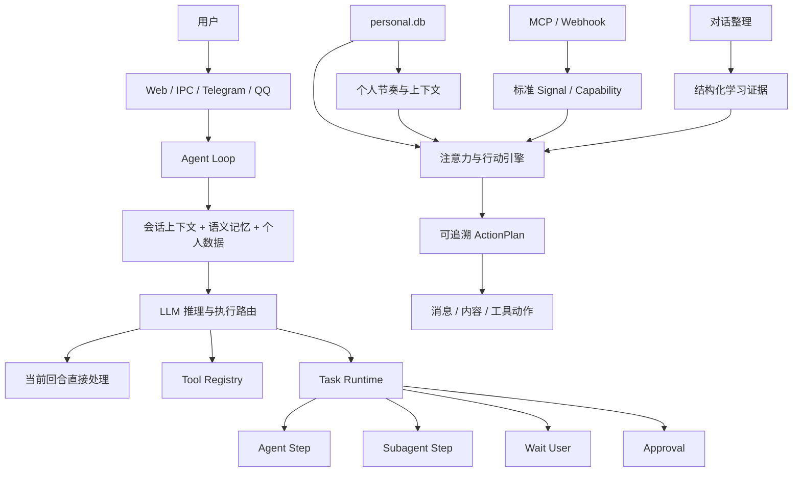

# 小满个人助手

小满是基于 Xiaoman Agent 演进的本地个人助手。它不仅提供聊天，还把长期记忆、个人数据、复杂任务、主动协助、场景状态、工具和外部连接统一到一套可持续扩展的执行框架中。

当前版本的核心目标是：

- 简单问题在当前对话内快速完成。
- 复杂任务进入可恢复、可审批的持久化任务中心。
- 个人事实经过来源、权限、冲突和生命周期治理。
- 主动联系必须说明“为什么现在提醒”，并尊重专注、睡前和用户反馈。
- 新能力通过 Skill、MCP、评估器或内部系统扩展接入，而不是为每个场景复制一条固定链路。

前端默认地址：[http://127.0.0.1:2236/](http://127.0.0.1:2236/)

## 当前能力概览

| 能力 | 当前状态 | 说明 |
|---|---|---|
| 实时聊天 | 已实现 | WebSocket 流式对话，Markdown 渲染，工具调用与会话历史 |
| 多模型接入 | 已实现 | 主模型、快速模型、Agent 模型和视觉模型分槽配置 |
| 工具系统 | 已实现 | 内置工具、延迟工具搜索、MCP 工具和权限风险标记 |
| 持久化任务中心 | 已实现 | 依赖图、等待用户、审批、重试、取消和重启恢复 |
| Subagent 执行 | 已实现 | 作为 Task Runtime 中受跟踪的隔离步骤，不是另一套用户任务 |
| Skills | 已实现 | 为 Agent 提供可复用方法和领域操作说明 |
| MCP 管理 | 已实现 | 标准服务目录、注册、连接、OAuth、工具查看和卸载 |
| 系统组件 | 已实现 | 记忆引擎、QQ、微信和企业微信等内部运行时适配器 |
| 语义记忆 | 已实现 | 对话摘要、Markdown 记忆和向量检索 |
| 记忆治理 | 已实现 | 分类、权限、冲突确认、锁定、有效期、导出与彻底删除 |
| 统一个人数据 | 已实现 | 个人资料、任务、日程、健康、关系、账单、旅行和目标 |
| 个人节奏 | 已实现 | 场景、专注、免打扰、即时任务推荐和周期回顾 |
| 主动协助 | 已实现 | 12 类默认规则、去重冷却、理由化消息和反馈学习 |
| AI 主动关注 | 已实现 | 周期、指定时间、无进展和条件型关注意图 |
| 通用 Proactive | 已实现 | 外部 alert/content/context 的拉取、判断和推送 |
| Drift | 已实现 | 无适合消息时执行空闲维护 Skill |
| 定时任务 | 已实现 | 固定消息和 AI 实时生成型任务 |
| Notion、日历、手表、邮件 | 待接入 | 核心数据契约已具备，具体连接器尚未配置 |
| 手机位置自动场景 | 待接入 | 当前可通过 Dashboard 或聊天切换场景 |

## 执行框架

### 总体结构



### 启动过程

```text
main.py
  -> bootstrap.app
  -> build_core_runtime
  -> 初始化模型、会话、记忆和工具
  -> 恢复 Task Runtime
  -> 连接 MCP、加载系统组件
  -> 启动 Scheduler
  -> 启动通用 Proactive / Drift
  -> 启动个人主动协助 Runtime
  -> 启动 Dashboard :2236
```

核心运行对象由 `bootstrap/core_runtime.py` 管理。Bootstrap 负责装配和生命周期，不承载个人业务规则。

### 普通对话路径

```text
用户消息
  -> 会话与记忆检索
  -> Prompt 渲染
  -> LLM 判断
  -> 直接回答或调用工具
  -> 流式输出
  -> 对话归档与记忆整理
```

适用于查询、解释、轻量分析和 1 到 3 步即可完成的操作。

### 复杂任务路径

复杂任务不通过复制整个 Agent Loop 或创建不可追踪的后台分身执行。模型调用 `task_create` 创建依赖图，由统一 Task Runtime 推进。

支持的步骤包括：

- `agent`：使用小满完整上下文和工具执行。
- `subagent`：在隔离目录中完成调研、分析、脚本或文档步骤。
- `wait_user`：等待用户补充信息。
- `approval`：外部写入、发送或高风险操作前等待确认。

任务执行位置和中断点由 LangGraph Checkpointer 保存在 `langgraph-workflows.db`，任务中心查询投影保存在 `langgraph-workflow-index.db`。服务重启后，未完成任务可以从节点检查点恢复。

### 主动协助路径

```text
个人记录、MCP 变化或对话中反复出现的规律
  -> 标准 Signal 或可追溯 Observation
  -> 显式规律直接确认，推断规律先积累证据
  -> 形成带置信度和生命周期的机会窗口/策略
  -> 动态匹配已注册 Capability
  -> 检查免打扰、安全权限、效用和打扰成本
  -> 生成唯一、幂等的 ActionPlan
  -> 执行后记录反馈，调整规则或窗口置信度
```

精确定时提醒仍由 Scheduler 按时执行，不经过机会评分。注意力引擎也不只
能“发消息”：安装新的 MCP 能力后，同一计划器可以选择内容推荐、创建待办、
整理资料或其他受权限治理的动作。

## 三类能力的边界

### Workflow

Workflow 是需要持久状态的执行实例。它负责步骤依赖、等待、审批、重试和恢复。

它不等于 Skill，也不应该用于每一次普通推荐。

### Skill

Skill 是可复用的方法说明，告诉 Agent 某类任务应该如何做。Skill 本身不是运行中的任务实例。

### MCP 与系统组件

MCP 是模型调用外部工具的标准协议。Skill 独立提供操作方法；MCP 独立提供可执行工具。记忆引擎和消息渠道属于系统组件，只负责运行时接入，不作为用户安装包，也不包装 Skill 或 MCP。

外部服务接入后应转换为标准个人记录或事件，而不是建立第二套个人数据和主动提醒系统。

## 个人数据与记忆

### 结构化个人数据

`personal.db` 是结构化个人事实源，目前支持：

- 个人资料和偏好边界。
- 承诺、可执行任务和每日计划。
- 日程和会议。
- 健康观测与情绪签到。
- 场景、专注和免打扰状态。
- 重要关系与联络周期。
- 重要日期。
- 账单、订阅和续费。
- 旅行、行程和准备清单。
- 目标与周期报告。
- AI 主动关注意图。

每条记录带有来源、来源引用、可信度、敏感级别、数据类别、访问策略、有效期、用户锁定、版本号和生命周期状态。

### 记忆分层

小满同时使用两类记忆：

1. 语义与会话记忆
   用于召回历史对话、摘要、经历和操作流程。

2. 受治理的个人记忆
   用于保存事实、偏好、临时状态和历史事件。

受治理记忆支持：

- 显示来源、时间和可信度。
- 健康、情感、关系、账号、位置和财务分级授权。
- 修改、锁定、设置有效期和软遗忘。
- 与现有事实冲突时等待用户保留、接受或合并。
- 完整导出记录、修订和冲突历史。
- 连同历史修订彻底删除。

语义记忆不作为结构化个人事实的最终真实数据源。

## 个人节奏与推荐

`core/personal/rhythm/` 负责把当前时间、场景、专注状态、免打扰、精力和个人事项合成统一上下文。

### 即时任务推荐

当用户说“我现在有 30 分钟”时，`personal_guidance` 会综合：

- 任务预计时长。
- 优先级与截止时间。
- 是否有明确下一步。
- 当前处于回家、出门、睡前或旅行场景。
- 当前精力是否适合高耗能任务。
- 今日计划和近期旅行清单。

推荐来源通过 `register_recommendation_provider` 扩展。健身、Notion 或其他 MCP 接入可以增加候选，不需要修改推荐主循环。

### 场景与专注

内置场景：

- 日常。
- 出门。
- 回家。
- 睡前。
- 旅行中。

专注模式支持 25、50、90 分钟和自定义时长。专注或睡前状态会延后普通提醒；允许高优先级提醒穿透时，仅高优先级消息可以立即投递。

### 周报、月报和目标偏差

周期报告从同一份个人数据计算：

- 已完成、待推进和逾期任务。
- 活跃任务平均进度。
- 睡眠和情绪趋势。
- 目标实际进度与时间进度差异。
- 下一周期建议。

内部系统组件可以通过 `register_report_contributor` 增加训练次数、学习时长等指标。

## 注意力与行动

系统没有把睡眠、健身、通勤或旅行写成固定规则。领域能力通过两个通用契约接入：

- Signal Provider 提交有来源、有时效、有置信度的变化事实。
- Capability 声明能执行的动作、支持的领域/场景、所需时间和风险等级。

对话整理或 Provider 还可以提交两种 Observation：重复出现的机会窗口，以及
影响主动行为的声明式策略。用户明确说出的长期要求可立即启用；AI 推断的规则
默认待验证，只有多次一致证据达到阈值后才启用，之后会随时间和负反馈降级或失效。
安全内核、审批和免打扰不能被学习规则绕过。

### AI 主动关注

用户可以说：

```text
每周五晚上问我这周训练恢复得怎么样。
这个目标三天没有进展就提醒我重新拆分。
下周三提醒我确认旅行证件。
```

支持的触发类型：

- 固定间隔。
- 指定时间，可设置日、周或月重复。
- 某条记录长时间没有进展。
- 某个结构化字段满足条件。

用户明确提出的关注可以立即启用。仅由 AI 推断出的关注会保存为“待启用”，不能绕过确认自动联系。

### 反馈学习

用户可以将提醒标记为：

- 已处理，表示建议有帮助。
- 忽略，表示当前建议价值较低。
- 稍后提醒，表示时机不合适。
- 关闭同类提醒。

反馈只更新它真正描述的维度：时机不对会降低机会窗口可信度，不感兴趣会降低
相关策略可信度，过于频繁会写入频率反馈。用户锁定的规则不会被自动学习覆盖。

这是一套可审计的策略调整，不是不可解释的在线模型训练。

## 通用 Proactive 与 Drift

项目原有 `proactive_v2` 仍负责开放内容源：

- `alert`：高优先级告警。
- `content`：由 LLM 判断价值的内容流。
- `context`：辅助主动判断的背景信息。

个人主动协助负责结构化个人事件、场景免打扰和反馈学习。两者目前是并行运行时，共享消息投递工具，但仍有独立的轮询和状态存储。

建议的外部接入方式是：

- 个人日程、健康、账单、目标变化转成 `PersonalRecord` 或 `PersonalEvent`，进入个人主动协助。
- 新闻、社区内容和宽泛信息流继续进入通用 Proactive。

Drift 在没有适合主动发送的内容时执行维护型 Skill，例如记忆审计、资料整理和自我诊断。

## 主要 Agent 工具

| 工具 | 用途 |
|---|---|
| `personal_context` | 读取经过访问策略过滤的个人记录 |
| `personal_record` | 创建、更新、确认或遗忘个人记录 |
| `personal_guidance` | 读取当前上下文、即时推荐、生成周报或月报 |
| `personal_rhythm` | 切换场景、控制专注、创建主动关注和记录反馈 |
| `personal_routine` | 创建晨间简报、晚间回顾和承诺捕获任务 |
| `task_create` | 创建持久化复杂任务依赖图 |
| `task_manage` | 查询、继续、审批、重试或取消任务 |
| `schedule` | 创建固定或 AI 生成型定时任务 |

## Dashboard

当前前端提供：

- 与小满实时聊天，支持 Markdown。
- “我的一天”计划与承诺工作台。
- “个人节奏”场景、专注、任务推荐和生活事项管理。
- 记忆治理、冲突确认、导出和彻底删除。
- 主动协助、规则开关、冷却时间和表达风格管理。
- Task Runtime 任务中心。
- 模型、频道、MCP、Skills 和工具管理。
- 定时任务和会话记录。

桌面与移动端均使用同一套响应式界面。

## 数据存储

默认工作区包含：

```text
personal.db       # 个人记录、治理冲突、主动规则、洞察、反馈和可靠事件
langgraph-checkpoints.db     # 主 Agent thread 检查点和中断恢复
langgraph-workflows.db       # 持久 Workflow 图检查点
langgraph-workflow-index.db  # 任务中心查询投影和事件
sessions.db       # 会话与消息
proactive.db      # 通用 Proactive 状态和日志
memory/           # Markdown 长期记忆
memory2.db        # 语义记忆与向量索引，具体名称依配置而定
schedules.json    # 定时任务
mcp_servers.json  # MCP 服务配置
skills/           # 用户 Skills
```

独立安装的 Skill 位于 `~/.xiaoman/skills/`，与工作区 Skill 和内置 Skill 分层加载。

当前单用户、本地进程部署使用 SQLite 即可，不强制依赖 Redis 或独立消息队列。

## 代码职责边界

| 路径 | 职责 |
|---|---|
| `core/personal/` | 个人领域模型、生命周期、记忆治理、节奏和主动评估 |
| `core/workflow/` | 与具体业务无关的任务状态机与契约 |
| `agent/looping/` | 对话 Agent Loop |
| `agent/tools/` | 面向模型的工具接口 |
| `agent/workflows/` | Task Runtime 和标准个人任务模板 |
| `core/attention/` | 信号、机会窗口、策略、行动计划与反馈闭环 |
| `proactive_v2/` | 数据源轮询和已规划消息的渠道投递 |
| `infra/persistence/` | SQLite 持久化实现 |
| `bootstrap/` | 依赖装配、服务启动和生命周期管理 |
| `frontend/dashboard/` | React 管理与聊天界面 |
| `plugins/` | 内部系统扩展：记忆后端、消息渠道等运行时适配器 |
| `agent/mcp/` | 标准 MCP 连接、凭据、目录和工具包装 |
| `agent/skill_packages.py` | 独立 Skill 的安装与卸载 |

## 典型场景

### 场景一：我现在有 30 分钟

```text
用户提问
  -> personal_guidance.recommend
  -> 获取场景、精力和时间窗口
  -> 聚合任务、今日计划和旅行清单
  -> 动态排序候选
  -> Agent 解释为什么推荐这一项
```

该场景不创建 Workflow。

### 场景二：执行复杂研究并形成报告

```text
用户提出复杂任务
  -> Agent 创建 Task Runtime
  -> 调研步骤使用 Subagent
  -> 汇总步骤消费调研结果
  -> 必要时等待用户或审批
  -> 失败自动重试，重启后恢复
  -> 完成后通知原会话
```

### 场景三：进入专注模式

```text
“我要专注 50 分钟”
  -> personal_rhythm.start_focus
  -> 写入有有效期的 Context State
  -> 主动协助检查到免打扰
  -> 普通消息延后，高优先级按策略处理
  -> 到期自动失效
```

### 场景四：保存敏感个人事实

```text
候选记忆
  -> 分类和权限推导
  -> 检查稳定键与现有事实
  -> 敏感或冲突内容进入待确认
  -> 用户选择保留、接受或合并
  -> 写入 personal.db 并记录修订
```

### 场景五：旅行准备

旅行记录保存目的地、时间、行程和准备清单。接入旅行 Signal Provider 后，
临近出发且清单未完成会成为带来源的候选变化，再由通用注意力引擎规划动作。

### 场景六：AI 定期找我

明确要求会生成已启用的 `proactive_intent`。AI 仅推断可能需要持续关注时，只生成待启用候选。所有关注都可在“个人节奏”中查看、编辑、关闭或删除。

### 场景七：周报和目标偏差

`personal_guidance.report` 聚合本周期任务、健康、情绪和目标数据。Agent 负责解释结果，结构化指标由统一报告服务计算。

### 场景八：外部来源真正变化

连接器对内容生成指纹。只有内容真实变化时才提交新的 Signal；引擎再通过
信号 ID、计划幂等键和反馈状态避免重复动作。

## 扩展新能力的推荐方式

1. 定义或复用一种 `PersonalEntityType`。
2. 让连接器将外部数据转换为标准个人记录或 `AttentionSignal`。
3. 需要即时建议时，注册 Recommendation Provider。
4. 需要周期统计时，注册 Report Contributor。
5. 需要主动参与时，注册 Signal Provider 和 Capability，不新增领域判断分支。
6. 可重复规律通过 Observation 学习，不把场景阈值写入核心代码。
7. 需要外部写操作时，通过工具或 MCP，并遵守审批与幂等约束。
8. 需要多步等待、确认或恢复时，创建 Task Runtime 定义。

不要为新领域复制 Agent Loop、独立任务系统或第二份个人数据库。

## 快速启动

当前本机使用 Conda 环境 `Xiaoman`：

```powershell
conda activate Xiaoman
python main.py
```

也可以直接运行：

```powershell
E:\anaconda3\envs\Xiaoman\python.exe main.py
```

启动后访问：

```text
http://127.0.0.1:2236/
```

## 当前限制

- Notion 官方 MCP 已可接入但仍需用户完成 OAuth；小米手表、外部日历、邮件和手机位置事件尚未实际接入。
- “出门、回家、睡前”目前通过 Dashboard 或聊天设置，尚未由手机自动触发。
- 即时推荐依赖任务估时、下一步、场景和精力字段；数据越完整，结果越可靠。
- 周报和月报只分析已经进入结构化个人数据的数据。
- 通用 Proactive 与个人主动协助仍是两个运行时，尚未合并轮询配额。
- Dashboard 设计为本机使用；没有额外认证时不要直接暴露到公网。

## 验证状态

当前实现已完成：

- 后端个人数据、记忆治理、Task Runtime、个人节奏和主动协助测试。
- 前端 TypeScript 类型检查、ESLint 和 Vite 生产构建。
- Dashboard 桌面与手机视口的无溢出和控件重叠检查。
- 使用现有 `personal.db` 的增量迁移和真实服务启动验证。

更细的职责边界见 [ARCHITECTURE.md](./ARCHITECTURE.md)，原始 Xiaoman 功能清单见 [README_FEATURES.md](./README_FEATURES.md)。
